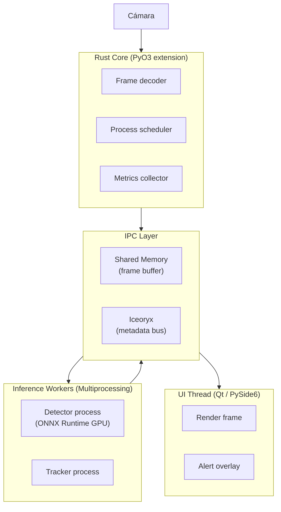

# Vigilia Edge — Desktop v1.0

> **Architecture showcase** · Source code is private · Pipeline docs and hybrid Python/Rust build template

> [!IMPORTANT]
> Este repositorio es de **exhibición**. Contiene únicamente documentación de arquitectura y
> una plantilla de build saneada. El código fuente del sistema Vigilia Edge es privado y no
> está incluido aquí. No hay binarios, modelos ni credenciales en este repositorio.

---

## Arquitectura de Escritorio

Vigilia Edge corre completamente en local — sin nube, sin latencia de red. El pipeline de video
va de cámara a UI en menos de 2 frames a 25 fps mediante una arquitectura zero-copy:

---

## Stack

| Capa | Tecnología | Rol |
|------|-----------|-----|
| Interfaz | PySide6 (Qt 6) | UI nativa de escritorio, renderizado de video |
| Inferencia | ONNX Runtime (GPU) | Detección de objetos en tiempo real |
| Núcleo | Rust (PyO3) | Decodificación de frames, scheduling, métricas |
| IPC | Shared Memory + Iceoryx | Transporte zero-copy entre procesos |
| Configuración | Hydra + Pydantic | Config jerárquica, validación de esquemas |
| Build híbrido | Maturin (maturin>=1.8) | Compila la extensión Rust y empaqueta Python |
| Observabilidad | Loguru + Pygame events | Logging estructurado, trazabilidad de eventos |

---

## Por qué Desktop-First

- **Privacidad absoluta**: ningún frame sale del equipo; inferencia 100% local.
- **Latencia determinista**: sin round-trip a cloud, pipeline de ~80ms de cámara a UI.
- **Integración con hardware**: acceso directo a GPU local y buses de baja latencia del SO.

---

## Estado

> v1.0 — operativo

El sistema está en uso en producción en entornos controlados. Esta versión Desktop es la base
sobre la que se construye la variante Edge embebida.

---

## Licencia

El código fuente de Vigilia Edge es **privado y propietario**. Este repositorio de exhibición
se publica únicamente con fines de documentación arquitectónica. No se concede ninguna licencia
de uso, copia o distribución del software subyacente.
