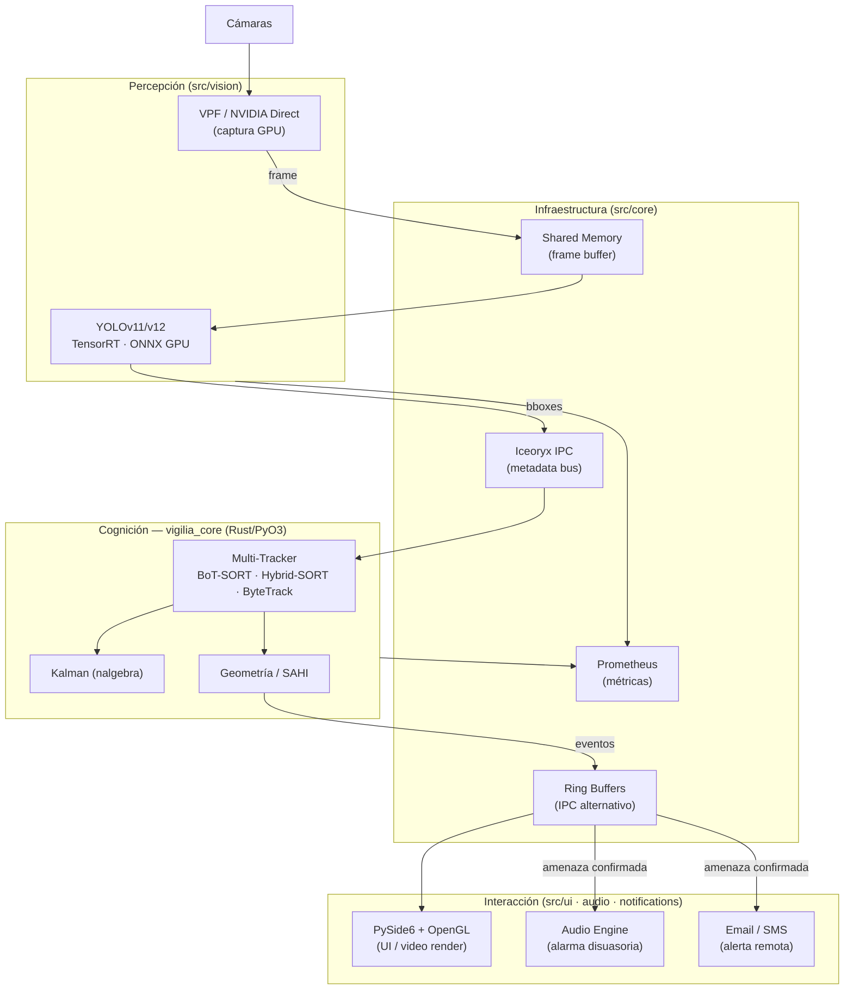

# Vigilia Edge — Desktop v1.1.0

> **Architecture showcase** · Source code is private · Pipeline docs and hybrid Python/Rust build template

> [!IMPORTANT]
> Este repositorio es de **exhibición**. Contiene únicamente documentación de arquitectura y
> una plantilla de build saneada. El código fuente del sistema Vigilia Edge es privado y no
> está incluido aquí. No hay binarios, modelos ni credenciales en este repositorio.

---

## Acerca del Proyecto

Vigilia Edge es un proyecto experimental enfocado en crear sistemas de monitoreo de video de alta eficiencia que operan totalmente en local. La idea es procesar flujos de video con mínima latencia, permitiendo detección de objetos en tiempo real sin depender de servicios en la nube.

Este repositorio documenta la arquitectura técnica y el diseño del sistema, mostrando cómo se integra el pipeline de visión artificial con una interfaz de escritorio fluida.

---

## Arquitectura de Escritorio

El sistema captura video y procesa los frames localmente, logrando una respuesta muy rápida mediante un pipeline optimizado:

---

## Stack

| Capa           | Tecnología                     | Rol                                                         |
| -------------- | ------------------------------ | ----------------------------------------------------------- |
| Interfaz       | PySide6 (Qt 6) + OpenGL        | UI nativa de escritorio, renderizado GPU de video           |
| Inferencia     | YOLOv11/v12 · ONNX Runtime GPU | Detección de objetos en tiempo real con ONNX backend        |
| Inferencia+    | TensorRT                       | Motor de inferencia compilado para GPU local — máx. rendimiento |
| Cognición      | Rust (PyO3) + nalgebra         | Multi-tracker, Kalman, geometría computacional, SAHI        |
| Captura        | VPF + NVIDIA Direct Capture    | Captura GPU-acelerada — sin round-trip a CPU                |
| IPC            | Shared Memory + Iceoryx        | Transporte zero-copy de frames entre procesos               |
| IPC alt.       | Ring Buffers                   | Canal IPC complementario para eventos y metadatos           |
| Configuración  | Hydra + Pydantic V2            | Config jerárquica con validación de schemas                 |
| Build híbrido  | Maturin (maturin>=1.8)         | Compila la extensión Rust y empaqueta Python                |
| Observabilidad | Prometheus + Loguru            | Métricas de producción + logging estructurado               |
| Respuesta      | Audio engine                   | Síntesis y reproducción de alarmas disuasorias              |
| Alertas        | Email / SMS                    | Notificaciones remotas ante amenazas confirmadas            |

---

## Tecnologías Utilizadas

Este proyecto combina Python y Rust para aprovechar la flexibilidad de Python en la configuración y la potencia de procesamiento de Rust en las tareas críticas de bajo nivel. El sistema busca alcanzar un balance entre facilidad de configuración y alto rendimiento.

---

## Estado

> v1.1.0 — operativo

El sistema es funcional y se utiliza para pruebas en entornos controlados. Es una base de trabajo para experimentar con variantes embebidas más eficientes.

---

## Soporte y Contacto

- Alertas del sistema: alertas@vigilia-security.tech
- Contacto técnico: [kenno@vigilia-security.tech](mailto:kenno@vigilia-security.tech)

## Licencia

El código fuente de Vigilia Edge es **privado y propietario**. Este repositorio de exhibición
se publica únicamente con fines de documentación arquitectónica. No se concede ninguna licencia
de uso, copia o distribución del software subyacente.
