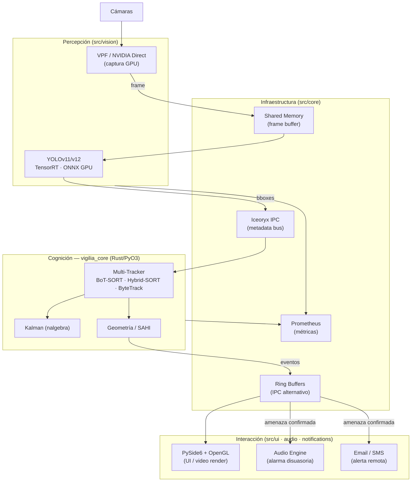

# Vigilia Edge — Desktop v1.0

> **Architecture showcase** · Source code is private · Pipeline docs and hybrid Python/Rust build template

> [!IMPORTANT]
> Este repositorio es de **exhibición**. Contiene únicamente documentación de arquitectura y
> una plantilla de build saneada. El código fuente del sistema Vigilia Edge es privado y no
> está incluido aquí. No hay binarios, modelos ni credenciales en este repositorio.

---

## Arquitectura de Escritorio

Vigilia Edge corre completamente en local — sin nube, sin latencia de red. El pipeline de video
va de cámara a UI en menos de 2 frames a 25 fps mediante una arquitectura zero-copy:

---

## Stack

| Capa           | Tecnología                     | Rol                                                         |
| -------------- | ------------------------------ | ----------------------------------------------------------- |
| Interfaz       | PySide6 (Qt 6) + OpenGL        | UI nativa de escritorio, renderizado GPU de video           |
| Inferencia     | YOLOv11/v12 · ONNX Runtime GPU | Detección de objetos en tiempo real con ONNX backend        |
| Inferencia+    | TensorRT                       | Motor de inferencia compilado para GPU local — máx. rendimiento |
| Cognición      | Rust (PyO3) + nalgebra         | Multi-tracker, Kalman, geometría computacional, SAHI        |
| Captura        | VPF + NVIDIA Direct Capture    | Captura GPU-acelerada — sin round-trip a CPU                |
| IPC            | Shared Memory + Iceoryx        | Transporte zero-copy de frames entre procesos               |
| IPC alt.       | Ring Buffers                   | Canal IPC complementario para eventos y metadatos           |
| Configuración  | Hydra + Pydantic V2            | Config jerárquica con validación de schemas                 |
| Build híbrido  | Maturin (maturin>=1.8)         | Compila la extensión Rust y empaqueta Python                |
| Observabilidad | Prometheus + Loguru            | Métricas de producción + logging estructurado               |
| Respuesta      | Audio engine                   | Síntesis y reproducción de alarmas disuasorias              |
| Alertas        | Email / SMS                    | Notificaciones remotas ante amenazas confirmadas            |

---

## Por qué Rust — Arquitectura Híbrida Python/Rust

El núcleo de Vigilia Edge (`vigilia-core`) es una extensión nativa Rust compilada vía PyO3.
Python orquesta y configura; Rust procesa frames donde la latencia y la seguridad de memoria importan.

| Motivación | Detalle |
|------------|---------|
| **Zero-copy operations** | Los buffers de ~6 MB/frame se asignan en Shared Memory una sola vez. Rust pasa punteros — nunca copia datos entre el decoder, el scheduler y los workers de inferencia |
| **Bypass del GIL** | El núcleo Rust corre en threads nativos de OS, sin el Global Interpreter Lock. Paralelismo real entre decodificación de frames y pipeline de inferencia GPU |
| **Rendimiento determinista** | Sin GC pauses. La latencia de cámara a UI es ~80ms a 25fps de forma consistente bajo carga sostenida |
| **Seguridad de memoria** | El compilador garantiza en tiempo de compilación: sin data races, sin dangling pointers en el pipeline de video — crítico en software de seguridad |
| **Multi-tracker configurable** | El núcleo Rust expone tres algoritmos de tracking (BoT-SORT, ByteTrack, Hybrid-SORT) seleccionables desde configuración sin recompilar — abstracción de alto rendimiento sin overhead de despacho desde Python |
| **Geometría computacional sin GIL** | Validaciones de zonas de intrusión y cruce de líneas con IoU vectorizado en Rust (nalgebra) — sin lock de intérprete Python en el hot path de análisis frame a frame |

---

## Por qué Desktop-First

- **Privacidad absoluta**: ningún frame sale del equipo; inferencia 100% local.
- **Latencia determinista**: sin round-trip a cloud, pipeline de ~80ms de cámara a UI.
- **Integración con hardware**: acceso directo a GPU local y buses de baja latencia del SO.

---

## Estado

> v1.0 — operativo

El sistema está en uso en producción en entornos controlados. Esta versión Desktop es la base
sobre la que se construye la variante Edge embebida.

---

## Soporte y Contacto

- Alertas del sistema: alertas@vigilia-security.tech
- Contacto técnico: [kenno@vigilia-security.tech](mailto:kenno@vigilia-security.tech)

## Licencia

El código fuente de Vigilia Edge es **privado y propietario**. Este repositorio de exhibición
se publica únicamente con fines de documentación arquitectónica. No se concede ninguna licencia
de uso, copia o distribución del software subyacente.
